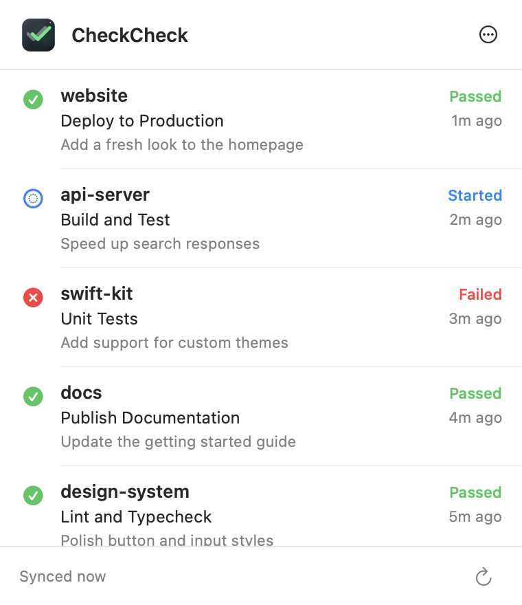

# CheckCheck

A small native macOS menu bar app that watches GitHub Checks and commit statuses on selected repositories and sends local notifications when their state changes.

<table>
  <tr>
    <td></td>
  </tr>
</table>

## Features

- Select repositories from your GitHub account.
- Watch the latest commit on each repository's default branch.
- See queued, running, successful, failed, skipped, and cancelled status checks.
- Receive notifications for new runs and status transitions.
- Open the exact Check details page from a row or notification.
- Keep the GitHub token in macOS Keychain.
- Launch automatically at login by default; turn it off in Settings.
- Avoid notification noise by treating the first synchronization as a baseline.

## Build

Requirements: macOS 14+, Xcode 15+, and [XcodeGen](https://github.com/yonaskolb/XcodeGen).

```sh
xcodegen generate
open CheckCheck.xcodeproj
```

Or build from Terminal:

```sh
xcodebuild -project CheckCheck.xcodeproj -scheme CheckCheck -configuration Debug build
```

The project uses ad-hoc signing for local development. Do not pass
`CODE_SIGNING_ALLOWED=NO`: macOS requires a signed app identity to register
local notification permissions.

## GitHub token

Create a [personal access token (classic)](https://github.com/settings/tokens/new?scopes=repo&description=CheckCheck%20for%20macOS) at GitHub Settings > Developer settings > Personal access tokens. GitHub's Checks API does not currently support fine-grained personal access tokens.

- Public repositories do not require a scope.
- Private repositories require the `repo` scope.

The token never leaves the Mac except in authenticated requests to `api.github.com`.

## MVP behavior

CheckCheck polls every 10 seconds while a check is queued or running, and once per minute while idle. It monitors current Check Runs and commit statuses from recent commits on each selected repository's default branch. The popover shows the last complete sync time. Incomplete syncs mark retained results as potentially out of date, with per-repository errors and retry actions in the details popover. Account and repository-list errors appear in their corresponding settings sections.

## Isolated UI validation

Build a QA-only binary with the `CHECKCHECK_QA` compilation condition and a separate bundle identifier:

```sh
xcodebuild -project CheckCheck.xcodeproj -scheme CheckCheck -configuration Debug \
  -derivedDataPath /tmp/checkcheck-ui-qa \
  PRODUCT_BUNDLE_IDENTIFIER=com.wong2.CheckCheck.UIQA \
  'SWIFT_ACTIVE_COMPILATION_CONDITIONS=DEBUG CHECKCHECK_QA' build
```

The QA control window switches disconnected, loading, error, connected, empty, and partial-failure fixtures within one process. It also previews the actual popover content and settings in light and dark appearances. Fixtures do not use the Keychain, network, notifications, or login-item registration. Normal builds omit the QA controls. Reuse one QA instance and quit it after validation; keep any production instance running.
